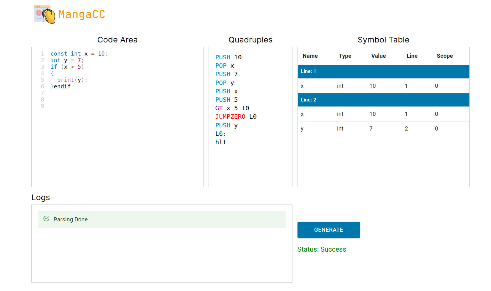

# MangaCC
<p align="center">
  
</p>
<p align="center">
  
</p>
<p align="center">
  
</p>

# Used Tools and Technologies

| Tool | Description |
|-----------|-------------|
| Flex      | Lexical Analyzer Generator              |
| Bison  | Parser Generator    |
| React      | Frontend framework used for GUI            |
| NodeJS     | Backend framework          |
| Github Actions       | CI to generate Binary and push it to backend directory          |


# Language Descriptions

## Tokens 

### 1- Variable and constant Declaration
  ```
  int x;
  int x = 5;
  const int x = 5;
  string x = "Hello";
  string x = "c";
  ```
- Available types 
  -  int
  -  float
  -  string
  -  bool

### 2- Mathematical and Logical expressions
- Mathematical operator
  -  +, -, *, /, %,
- Logical operator
  -  ==, !=, >, <, >=, <=
  - and , or , not , xor 

## 3 - Assignment statement
  ```
  x = 5;
  x = "Hello";
  x = 5.5;
  x = true;
  ```
## 4 - If else statement
  
  ```
  if (x == 5 and y == 10) {
    x = 10;
  } endif
  ```
  ```
  if (x >= 5 or y <= 10) {
    x = x +1 ;
  } else {
    x = x - 1;
  }
  ```
  ```
  if (x < 5 and y > 10) {
    x = x + 1;
  } else if (x > 5) {
    x = x - 1;
  } else {
    x = 0;
  } 
  ```
  
## 5 - While loop
  ```
  while (x < 5) {
    x = x + 1;
  }
  ```
## 6 - Repeat until
  ```
  repeat {
    x = x + 1;
  } until (x == 5);
  ```
## 7 - For loop
  ```
  for (int i = 0; i < 5; i = i + 1) {
    x = x + 1;
  }
  ```
## 8 - Switch case
  ```
  switch (x) {
    case 1:
      x = 1;
      break;
    case 2:
      x = 2;
      break;
    default:
      x = 0;
  }
  ```
## 9 - Function declaration
  ```
  int func1(int x, int y) {
    return x + y;
  }
  ```
  ```
  void func2(int x) {
    x = x + 1;
  }
  ```
  ```
  int func3() {
    return 5;
  }
  ```
## 10 - Function call
  ```
  int x = func1(5, 10);
  func2(5);
  int y = func3();
  ```

## 11 - Block structure
  ```
  {
    int x = 5;
    {
      x = x + 1;
    }
  }
  ```
## 12- Comments
  ```
  // This is a comment
  ```

## 13- Print
  ```
  print("Hello World");
  print(x);
  print(5);
  print(5+6);
  ```

## 14- Enum
  ```
  enum Color {
    RED,
    GREEN,
    BLUE
  }
  enum Color c = RED;
  ```

## How to run

- There is a script named **build.sh** that generates the parser and lexer and takes test file from you as input argurmnt.

- You can run the script by typing the following command in the terminal:

  ```
  ./build.sh if_test.c
  ```

- Note: the test file should be in the test_cases folder.

- Errors and warning will be printed to the terminal.

- Symbol table will be generated in a txt file named **symbol_table.txt**.

- The quadruples will be generated in a txt file named **quads.txt**.

## Quadraples Description
| Quadraple | Description |
|-----------|-------------|
| PUSH (value)     | Pushing (value) to stack              |
| POP  (ID) | Pop value from stack to the (ID)    |
| NOT       | Getting complement of value            |
| ADD (arg1) (arg2) (result)     | Adding (arg1) (arg2) and save value to (result)           |
| SUB   (arg1) (arg2) (result)     | Substracting (arg1) (arg2) and save value to (result)             |
| MUL       | Multiply (arg1) (arg2) and save value to (result)           |             |
| DIV       | Divide (arg1) (arg2) and save value to (result)           |            |
| MOD       | Calculate the modules of (arg1) (arg2) and save value to (result)           |            |
| AND       |  Perform logical and between (arg1) (arg2) and save value to (result)           |            |
| OR        |  Perform logical or between (arg1) (arg2) and save value to (result)            |
| XOR       | Perform logical xor between (arg1) (arg2) and save value to (result)            |
| EQ        |  Check the equality of the two operands and store the comparsion result in temp reg           |
| NE        | Check the inequality of the two operands and store the comparsion result in temp reg            |
| LT        | Check if the first operand is less than the second and store the comparison result in temp reg            |
| GT        | Check if the first operand is greater than the second and store the comparison result in temp reg            |
| LE        | Check if the first operand is less than or equal the second and store the comparison result in temp reg            |
| GE        | Check if the first operand is greater than or equal the second and store the comparison result in temp reg            |
| JMP L():      |  Unconditional Jump to label           |
| JUMPZERO L(): |  Jump if the zero flag from previous command is zero           |
| JMPNONZERO L():| Jump if the zero flag from previous command is non-zero            |
| Convi (var/value)    | Convert float to integer            |
| Convf (var/value)    | Convert integer to float            |


## Bouns


<p align="center">
  
  
</p>
